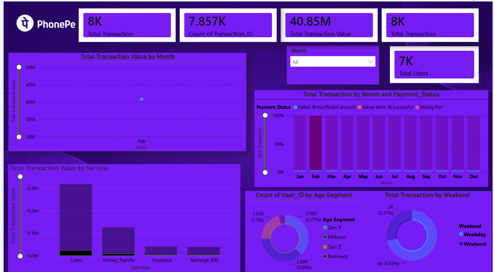

# PhonePe-Transaction-Analytics-Dashboard
# 📱 PhonePe Transaction Analytics Dashboard

## 📌 Project Overview

The PhonePe Transaction Analytics Dashboard is an interactive Power BI project designed to analyze transaction patterns, user behavior, service performance, and payment success rates across different categories.

This dashboard provides valuable insights into transaction volume, transaction value, user demographics, service usage, and payment status trends, helping stakeholders understand platform performance and customer engagement.

---




## 🎯 Business Objective

The primary objective of this dashboard is to:

* Monitor transaction performance across services.
* Track total transaction value and volume.
* Analyze user demographics and age segments.
* Evaluate payment success and failure trends.
* Identify the most utilized services.
* Support data-driven decision making.

---

## 📊 Dashboard Highlights

### KPI Metrics

* Total Transactions: **8K**
* Total Transaction IDs: **7.857K**
* Total Transaction Value: **₹40.85M**
* Total Users: **7K**

---

### Key Insights

#### Transaction Value by Month

* Monthly transaction value trend analysis.
* Helps identify peak transaction periods.

#### Transaction Status Analysis

* Successful Transactions
* Failed Transactions
* Wrong PIN
* Insufficient Balance
* Server Errors

Provides visibility into payment success rates and operational performance.

#### Transaction Value by Service

Analysis across services:

* Loans
* Money Transfer
* Insurance
* Recharge & Bills

Identifies the highest revenue-generating services.

#### User Demographics Analysis

Age-based segmentation:

* Gen Z
* Millennials
* Gen X
* Boomers

Helps understand customer distribution and target audiences.

#### Weekend vs Weekday Transactions

Comparison of user activity during:

* Weekdays
* Weekends

Useful for identifying customer behavior patterns.

---

## 🛠 Tools & Technologies

* Power BI
* Power Query
* DAX
* Data Modeling
* Data Visualization

---

## 📈 Dashboard Features

* Interactive Filters & Slicers
* Dynamic KPI Cards
* Monthly Trend Analysis
* Service-wise Performance Tracking
* User Segmentation Analysis
* Payment Status Monitoring
* Responsive Dashboard Design

---

## 💡 Business Insights

* Transaction volume remains consistently high across the platform.
* Loan services contribute the highest transaction value.
* Successful payments dominate transaction activity.
* Millennials represent the largest user segment.
* Weekday transactions exceed weekend activity.

---

## 📷 Dashboard Preview

Add your dashboard screenshot here:

```markdown

```

---

## 🚀 Future Enhancements

* State-wise transaction analysis
* District-level insights
* Fraud detection analytics
* Customer retention analysis
* Transaction forecasting using Machine Learning
* Real-time dashboard integration

---

## 👨‍💻 Author

**Pawan Jogi**
B.Tech – Computer Science & Engineering (Data Science)

### Connect With Me

* LinkedIn: [www.linkedin.com/in/pawan-jogi](http://www.linkedin.com/in/pawan-jogi)
* GitHub: github.com/PawanJogi

---


